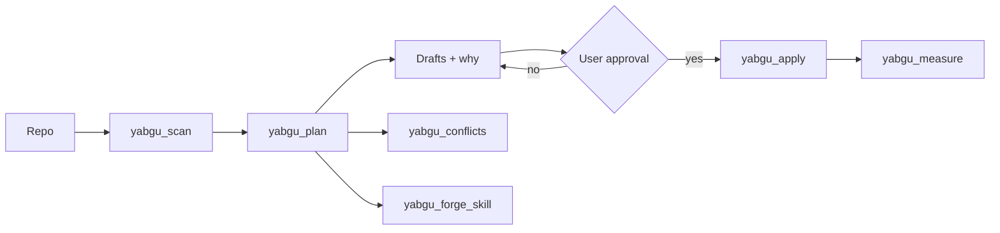

<p align="center">
  
</p>

<p align="center">
  <strong>Yabgu</strong> — an Old Turkic title: the ruler who carries out the khagan’s work.<br/>
  In this repo the model is not the khagan; short instruction files are the yabgu.
</p>

<p align="center">
  <a href="LICENSE"></a>
  <a href="package.json"></a>
  <a href="src/mcp.ts"></a>
  <a href="docs/product.md"></a>
</p>

---

**Goal:** Make coding agents (Cursor, Claude, Codex, Copilot, Gemini, Grok, and similar) **more accurate** and **cheaper on tokens** — without switching models — by fixing the instruction files loaded every turn.

| Catalog + templates | Local MCP |
| --- | --- |
| Native file matrix, writing guide, copy-paste starters | `scan` → `plan` → approve → `apply` · `measure` / `conflicts` / `forge_skill` |



> Local **stdio** MCP. Repo contents never go to a yabgu server. For Copilot cloud use `YABGU_READ_ONLY=1`.

Project timeline: [docs/history.md](docs/history.md).

## Why tokens drop and accuracy rises

The agent stops rediscovering the stack, test command, and “do not” list on every message. Discovery turns are the expensive part.

| Common mistake | Result |
| --- | --- |
| Pasting the same text into `CLAUDE.md` + `AGENTS.md` + Copilot | Tokens × tools · conflicts → wrong code |
| An 800-line always-on rule file | Context bloat; rules ignored |
| No instruction files at all | Re-scans and invents every time |
| Expecting ChatGPT web to load repo markdown | It does not; paste into product settings |

Correct shape: thin `AGENTS.md` + thin adapters → [shared source of truth](docs/shared-source-of-truth.md) · [how to write](docs/how-to-write.md) · [hosts / MCP](docs/hosts.md)

## Quick matrix

| Tool | Prefer these | Optional / native | Usually does not load |
| --- | --- | --- | --- |
| **Cursor** | `AGENTS.md`, `.cursor/rules/*.mdc` | `.cursor/skills/*/SKILL.md` | `CLAUDE.md` |
| **Claude Code** | `CLAUDE.md` or `.claude/CLAUDE.md` | `.claude/rules/`, skills, `CLAUDE.local.md` | `AGENTS.md` (not directly) |
| **ChatGPT / Codex** | `AGENTS.md` | `AGENTS.override.md`, `~/.codex/AGENTS.md` | `CLAUDE.md` (not directly) |
| **GitHub Copilot** | `.github/copilot-instructions.md`, `AGENTS.md` | `.github/instructions/*.instructions.md` | — |
| **Gemini CLI** | `GEMINI.md` | `~/.gemini/GEMINI.md`, optional `AGENTS.md` via settings | — |
| **Grok Build** | `AGENTS.md` | skills, hooks; `grok inspect` | — |
| **Windsurf** | `AGENTS.md`, `.devin/rules/*.md` | `.windsurf/rules/` (legacy), skills | — |
| **Cline / Roo** | `.clinerules` or `.clinerules/` | `AGENTS.md` (support growing) | — |
| **ChatGPT web** | In-product Instructions | Project instructions | Repo `.md` is not auto-loaded |

Details: [docs/matrix.md](docs/matrix.md)

## Setup

### npm (recommended)

npm rejected the unscoped name `yabgu` as too similar to `yargs`, so the package is scoped:

```bash
npm install -g @emrahyasinisik/yabgu
yabgu mcp
# or without a global install:
npx @emrahyasinisik/yabgu measure .
npx @emrahyasinisik/yabgu conflicts .
npx @emrahyasinisik/yabgu forge .
```

Requires Node.js 18+. After install, wire the MCP into your host with:

```text
yabgu_host_setup  →  host=cursor|claude|codex|copilot|…
```

### 1) Catalog only (no MCP)

```bash
git clone https://github.com/emrahyasinisik/Yabgu.git
cp Yabgu/templates/AGENTS.md /path/to/your-project/AGENTS.md
```

Or after a global install, copy from the package:

```bash
cp "$(npm root -g)/@emrahyasinisik/yabgu/templates/AGENTS.md" /path/to/your-project/AGENTS.md
```

1. [`templates/AGENTS.md`](templates/AGENTS.md) → repo root (Cursor, Codex, Copilot, Grok)
2. Claude → [`templates/CLAUDE.md`](templates/CLAUDE.md) (`@AGENTS.md`)
3. Cursor glob rules → [`templates/cursor/`](templates/cursor/)
4. Copilot → [`templates/copilot/`](templates/copilot/)

### 2) Local MCP from source

```bash
git clone https://github.com/emrahyasinisik/Yabgu.git
cd Yabgu
npm install
npm run build
npx yabgu mcp
```

Host install snippet (Cursor / Claude / Codex / Copilot / …):

```text
yabgu_host_setup  →  host=cursor|claude|codex|copilot|…
```

Or see [docs/hosts.md](docs/hosts.md). First query: [docs/first-query.md](docs/first-query.md)

| Tool | Role |
| --- | --- |
| `yabgu_scan` / `yabgu_plan` | Local scan + justified drafts |
| `yabgu_apply` | Writes only after approval (elicitation or `confirmed=true`) |
| `yabgu_measure` | Setup health (before/after) — not a token-savings claim |
| `yabgu_conflicts` | Opposing do/don’t rules + mismatched test/lint commands |
| `yabgu_forge_skill` | Procedure → `SKILL.md` draft (does not write; apply after) |
| `yabgu_get_started` / `yabgu_template` / `yabgu_host_*` | Guides, templates, install snippets |

`YABGU_READ_ONLY=1` → `yabgu_apply` disabled (for Copilot cloud).

CLI extras: `npx @emrahyasinisik/yabgu measure <path>` · `conflicts` · `forge`

## Recommended layout

```text
your-project/
├── AGENTS.md                          # shared source of truth
├── CLAUDE.md                          # @AGENTS.md + Claude-only notes
├── GEMINI.md                          # thin Gemini adapter
├── .cursor/rules/                     # scoped .mdc
├── .cursor/skills/.../SKILL.md        # task procedure (not every turn)
├── .claude/rules/ · .claude/skills/
├── .devin/rules/                      # Cascade (legacy: .windsurf/rules/)
└── .github/
    ├── copilot-instructions.md
    └── instructions/*.instructions.md
```

## Host guides & templates

| Guide | Templates |
| --- | --- |
| [Cursor](tools/cursor.md) | [`always-apply.mdc`](templates/cursor/always-apply.mdc) · [`glob-rule.mdc`](templates/cursor/glob-rule.mdc) |
| [Claude Code](tools/claude.md) | [`CLAUDE.md`](templates/CLAUDE.md) · [`testing.md`](templates/claude/testing.md) |
| [ChatGPT / Codex](tools/chatgpt-codex.md) | [`AGENTS.md`](templates/AGENTS.md) |
| [GitHub Copilot](tools/github-copilot.md) | [`copilot-instructions.md`](templates/copilot/copilot-instructions.md) |
| [Gemini CLI](tools/gemini.md) | [`GEMINI.md`](templates/GEMINI.md) · [`settings.json`](templates/gemini/settings.json) |
| [Grok Build](tools/grok.md) | [`AGENTS.md`](templates/AGENTS.md) · [`SKILL.md`](templates/skills/SKILL.md) |
| [Windsurf](tools/windsurf.md) | [`style.md`](templates/windsurf/style.md) → `.devin/rules/` |
| [Cline, Roo, OpenCode, …](tools/others.md) | [`clinerules.md`](templates/cline/clinerules.md) · [`web-instructions.md`](templates/chatgpt/web-instructions.md) |

## What goes where?

| Content | File |
| --- | --- |
| Build / test / style / architecture (all tools) | `AGENTS.md` |
| Claude `@` import, plan mode | `CLAUDE.md` |
| Cursor glob / alwaysApply | `.cursor/rules/*.mdc` |
| Long task procedures | `SKILL.md` |
| Personal, do not commit | `CLAUDE.local.md` / `AGENTS.override.md` |
| Copilot path-specific | `.github/instructions/*.instructions.md` |

Target: keep `AGENTS.md` under ~200 lines.

## What this is not

- Does **not** control how the agent speaks (tone, address, language)
- Not a model picker / Auto router
- Does not inject hidden files into ChatGPT web
- Does not claim “%X token savings” without measurement → [docs/measure.md](docs/measure.md)

Privacy & product rules: [docs/product.md](docs/product.md) · consumer example: [examples/README.md](examples/README.md) · conflicts & forge: [docs/conflicts-forge.md](docs/conflicts-forge.md)

## License

[MIT](LICENSE) © 2026 Emrah Yasin IŞIK

## References

[AGENTS.md](https://agents.md/) · [Claude memory](https://code.claude.com/docs/en/memory) · [Cursor rules](https://cursor.com/docs/rules) · [Codex AGENTS.md](https://developers.openai.com/codex/guides/agents-md) · [Copilot instructions](https://docs.github.com/en/copilot/how-tos/copilot-on-github/customize-copilot/add-repository-instructions) · [Gemini.md](https://github.com/google-gemini/gemini-cli/blob/main/docs/cli/gemini-md.md) · [Grok Build](https://docs.x.ai/build/overview) · [Cursor MCP](https://cursor.com/docs/mcp) · [Claude MCP](https://code.claude.com/docs/en/mcp) · [Codex MCP](https://developers.openai.com/codex/mcp) · [Copilot MCP](https://docs.github.com/en/copilot/how-tos/use-copilot-agents/coding-agent/extend-coding-agent-with-mcp) · [Gemini MCP](https://google-gemini.github.io/gemini-cli/docs/tools/mcp-server.html) · [Grok MCP](https://docs.x.ai/build/features/mcp-servers) · [Windsurf MCP](https://docs.devin.ai/windsurf/plugins/cascade/mcp) · [OpenCode](https://opencode.ai/docs/config/)
