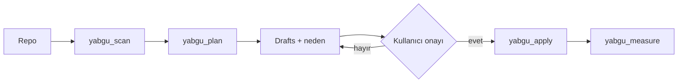

<p align="center">
  
</p>

<p align="center">
  <strong>Yabgu</strong> — Göktürk unvanı: kağanın yanında işi yürüten yönetici.<br/>
  Bu repoda model kağan değil; kısa talimat dosyaları yabgudur.
</p>

<p align="center">
  <a href="LICENSE"></a>
  <a href="package.json"></a>
  <a href="src/mcp.ts"></a>
  <a href="docs/product.md"></a>
</p>

---

**Amaç:** Cursor, Claude, Codex, Copilot, Gemini, Grok ve benzeri ajanları **daha doğru** ve **daha az token** ile kullanmak — modeli değiştirmeden, her turda yüklenen talimatı düzelterek.

| Katalog + şablonlar | Yerel MCP |
| --- | --- |
| Native dosya matrisı, yazım rehberi, copy-paste starters | `scan` → `plan` → onay → `apply` · `measure` before/after |



> Yerel **stdio** MCP. Repo içeriği yabgu sunucusuna gitmez. Copilot cloud için `YABGU_READ_ONLY=1`.

## Neden token düşer, doğruluk artar

Ajan her mesajda stack’i, test komutunu ve “yapma” listesini yeniden keşfetmez. Keşif turları en pahalı kısımdır.

| Yapılan hata | Sonuç |
| --- | --- |
| Aynı metni `CLAUDE.md` + `AGENTS.md` + Copilot’a yapıştırmak | Token × araç · çelişince yanlış kod |
| 800 satırlık her-oturum kuralı | Bağlam şişer, kurala uyulmaz |
| Hiç dosya olmaması | Her seferinde tarar, uydurur |
| ChatGPT web’den repo md beklemek | Dosya yüklenmez; ayara yazılmalı |

Doğru düzen: ince `AGENTS.md` + ince adaptör → [shared source of truth](docs/shared-source-of-truth.md) · [nasıl yazılır](docs/how-to-write.md) · [host / MCP](docs/hosts.md)

## Hızlı cevap

| Araç | Önce bunları kullan | İsteğe bağlı / native | Okumaz (varsayılan) |
| --- | --- | --- | --- |
| **Cursor** | `AGENTS.md`, `.cursor/rules/*.mdc` | `.cursor/skills/*/SKILL.md` | `CLAUDE.md` |
| **Claude Code** | `CLAUDE.md` veya `.claude/CLAUDE.md` | `.claude/rules/`, skills, `CLAUDE.local.md` | `AGENTS.md` (doğrudan değil) |
| **ChatGPT / Codex** | `AGENTS.md` | `AGENTS.override.md`, `~/.codex/AGENTS.md` | `CLAUDE.md` (doğrudan değil) |
| **GitHub Copilot** | `.github/copilot-instructions.md`, `AGENTS.md` | `.github/instructions/*.instructions.md` | — |
| **Gemini CLI** | `GEMINI.md` | `~/.gemini/GEMINI.md`, ayarla `AGENTS.md` | — |
| **Grok Build** | `AGENTS.md` | skills, hooks; `grok inspect` | — |
| **Windsurf** | `AGENTS.md`, `.devin/rules/*.md` | `.windsurf/rules/` (eski), skills | — |
| **Cline / Roo** | `.clinerules` veya `.clinerules/` | `AGENTS.md` (destek artıyor) | — |
| **ChatGPT web** | Ürün içi Instructions | Project instructions | Repo `.md` otomatik yüklenmez |

Detay: [docs/matrix.md](docs/matrix.md)

## Kurulum

### 1) Katalog (her yerde çalışır)

```bash
# şablonları kendi projenize kopyalayın
cp templates/AGENTS.md /path/to/your-project/AGENTS.md
```

1. [`templates/AGENTS.md`](templates/AGENTS.md) → repo kökü (Cursor, Codex, Copilot, Grok)
2. Claude → [`templates/CLAUDE.md`](templates/CLAUDE.md) (`@AGENTS.md`)
3. Cursor glob kuralları → [`templates/cursor/`](templates/cursor/)
4. Copilot → [`templates/copilot/`](templates/copilot/)

### 2) Yerel MCP

```bash
npm install
npm run build
npx yabgu mcp
```

Host snippet (Cursor / Claude / Codex / Copilot / …):

```text
yabgu_host_setup  →  host=cursor|claude|codex|copilot|…
```

veya [docs/hosts.md](docs/hosts.md). İlk sorgu: [docs/first-query.md](docs/first-query.md)

| Tool | Ne yapar |
| --- | --- |
| `yabgu_scan` / `yabgu_plan` | Yerel tarama + gerekçeli draft |
| `yabgu_apply` | Yalnız onay sonrası yazar (elicitation veya `confirmed=true`) |
| `yabgu_measure` | Setup health (before/after) — token iddiası değil |
| `yabgu_conflicts` | Çelişen do/don't + farklı test/lint komutları |
| `yabgu_forge_skill` | Prosedür → `SKILL.md` draft (yazmaz; apply sonra) |
| `yabgu_get_started` / `yabgu_template` / `yabgu_host_*` | Rehber + şablon + kurulum |

`YABGU_READ_ONLY=1` → `yabgu_apply` kapalı (Copilot cloud için).

## Önerilen repo düzeni

```text
your-project/
├── AGENTS.md                          # ortak kaynak
├── CLAUDE.md                          # @AGENTS.md + Claude notları
├── GEMINI.md                          # ince Gemini adaptörü
├── .cursor/rules/                     # scoped .mdc
├── .cursor/skills/.../SKILL.md        # görev prosedürü (her tura girmez)
├── .claude/rules/ · .claude/skills/
├── .devin/rules/                      # Cascade (eski: .windsurf/rules/)
└── .github/
    ├── copilot-instructions.md
    └── instructions/*.instructions.md
```

## Araç rehberleri & şablonlar

| Rehber | Şablon |
| --- | --- |
| [Cursor](tools/cursor.md) | [`always-apply.mdc`](templates/cursor/always-apply.mdc) · [`glob-rule.mdc`](templates/cursor/glob-rule.mdc) |
| [Claude Code](tools/claude.md) | [`CLAUDE.md`](templates/CLAUDE.md) · [`testing.md`](templates/claude/testing.md) |
| [ChatGPT / Codex](tools/chatgpt-codex.md) | [`AGENTS.md`](templates/AGENTS.md) |
| [GitHub Copilot](tools/github-copilot.md) | [`copilot-instructions.md`](templates/copilot/copilot-instructions.md) |
| [Gemini CLI](tools/gemini.md) | [`GEMINI.md`](templates/GEMINI.md) · [`settings.json`](templates/gemini/settings.json) |
| [Grok Build](tools/grok.md) | [`AGENTS.md`](templates/AGENTS.md) · [`SKILL.md`](templates/skills/SKILL.md) |
| [Windsurf](tools/windsurf.md) | [`style.md`](templates/windsurf/style.md) → `.devin/rules/` |
| [Cline, Roo, OpenCode, …](tools/others.md) | [`clinerules.md`](templates/cline/clinerules.md) · [`web-instructions.md`](templates/chatgpt/web-instructions.md) |

## Ne nereye yazılır?

| İçerik | Dosya |
| --- | --- |
| Build / test / stil / mimari (her araç) | `AGENTS.md` |
| Claude `@` import, plan mode | `CLAUDE.md` |
| Cursor glob / alwaysApply | `.cursor/rules/*.mdc` |
| Görev bazlı uzun prosedür | `SKILL.md` |
| Kişisel, commit edilmeyecek | `CLAUDE.local.md` / `AGENTS.override.md` |
| Copilot path-specific | `.github/instructions/*.instructions.md` |

Hedef: `AGENTS.md` ~200 satırın altında.

## Bu repo ne değil

- Ajanın **nasıl konuştuğuna** karışmaz (ton, hitap, dil)
- Model seçici / Auto router değil
- ChatGPT web’e gizli dosya enjekte etmez
- Ölçümsüz “%X token tasarrufu” iddiası vermez → [docs/measure.md](docs/measure.md)

Gizlilik ve ürün kuralı: [docs/product.md](docs/product.md) · consumer örneği: [examples/README.md](examples/README.md)

## Kaynaklar

[AGENTS.md](https://agents.md/) · [Claude memory](https://code.claude.com/docs/en/memory) · [Cursor rules](https://cursor.com/docs/rules) · [Codex AGENTS.md](https://developers.openai.com/codex/guides/agents-md) · [Copilot instructions](https://docs.github.com/en/copilot/how-tos/copilot-on-github/customize-copilot/add-custom-instructions/add-repository-instructions) · [Gemini.md](https://github.com/google-gemini/gemini-cli/blob/main/docs/cli/gemini-md.md) · [Grok Build](https://docs.x.ai/build/overview) · [Cursor MCP](https://cursor.com/docs/mcp) · [Claude MCP](https://code.claude.com/docs/en/mcp) · [Codex MCP](https://developers.openai.com/codex/mcp) · [Copilot MCP](https://docs.github.com/en/copilot/how-tos/use-copilot-agents/coding-agent/extend-coding-agent-with-mcp) · [Gemini MCP](https://google-gemini.github.io/gemini-cli/docs/tools/mcp-server.html) · [Grok MCP](https://docs.x.ai/build/features/mcp-servers) · [Windsurf MCP](https://docs.devin.ai/windsurf/plugins/cascade/mcp) · [OpenCode](https://opencode.ai/docs/config/)
