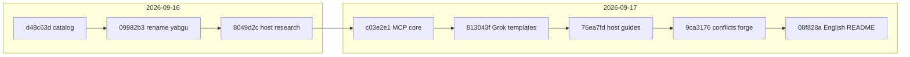
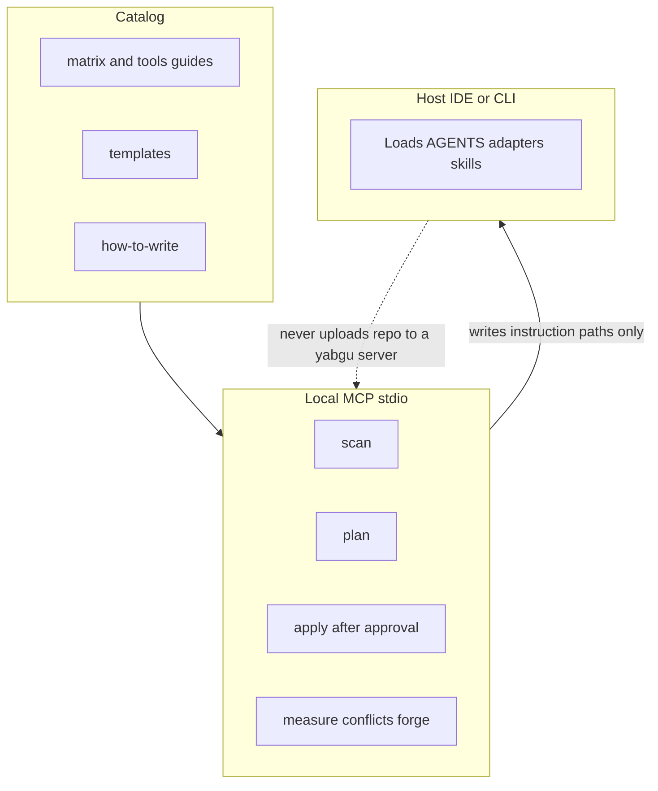

# History

Short timeline of what shipped on `main` before the public release. English summary; commit messages are the source of truth (`git log`).

## Timeline

GitHub’s Mermaid build is picky about `timeline` diagrams and special characters in labels (`*`, `—`, `·`), so this history uses a plain flowchart instead.

## Commits (oldest → newest)

| SHA | Date | Summary |
| --- | --- | --- |
| [`d48c63d`](https://github.com/emrahyasinisik/Yabgu/commit/d48c63d) | 2026-09-16 | Catalog of which files Cursor, Claude, Codex, Copilot, and others load, plus copy-paste templates |
| [`09982b3`](https://github.com/emrahyasinisik/Yabgu/commit/09982b3) | 2026-09-16 | Rename to **yabgu**; Old Turkic metaphor and purpose up front |
| [`8049d2c`](https://github.com/emrahyasinisik/Yabgu/commit/8049d2c) | 2026-09-16 | Official host research; future MCP constrained to local-only |
| [`c03e2e1`](https://github.com/emrahyasinisik/Yabgu/commit/c03e2e1) | 2026-09-17 | Local stdio MCP: scan / plan / apply / measure, elicitation & read-only guards, README |
| [`813043f`](https://github.com/emrahyasinisik/Yabgu/commit/813043f) | 2026-09-17 | Grok guide, native templates, clean example “before” state; Windsurf `.devin/rules` alignment |
| [`76ea7fd`](https://github.com/emrahyasinisik/Yabgu/commit/76ea7fd) | 2026-09-17 | Gemini, Windsurf, and others host guides matched to templates |
| [`9ca3176`](https://github.com/emrahyasinisik/Yabgu/commit/9ca3176) | 2026-09-17 | Conflict radar + skill forge (`yabgu_conflicts`, `yabgu_forge_skill`) |

## Architecture (product layers)

## Stack map (what each layer owns)

| Layer | Owns | Does not own |
| --- | --- | --- |
| Catalog | Filenames, limits, writing rules, starters | How the model speaks |
| MCP | Scan/plan drafts, apply, health/conflicts/forge | Remote SaaS analysis |
| Host | Loading files into context each turn | Yabgu’s privacy boundary |

## Suggested GitHub metadata (when opening the repo)

Use these in the GitHub UI (repo → About gear, or Settings → General):

- **Description:** `Short instruction files for coding agents — catalog, templates, and a local stdio MCP`
- **Topics:** `mcp` · `agents` · `agents-md` · `cursor` · `claude-code` · `codex` · `github-copilot` · `gemini-cli` · `grok` · `instruction-files`
- **Website:** `https://emrahyasinisik.github.io/Yabgu/` (GitHub Pages from `site/`)

## Onboarding UX (post-release)

- README leads with copy-paste Cursor/Claude MCP install (no chicken-egg via `yabgu_host_setup`).
- CLI: `yabgu setup <host> [--write] [--overwrite]` writes project MCP configs when supported.
- Promo site: static `site/` on GitHub Pages; demo GIFs under `assets/`.

## Notes for consumers

- License: MIT
- Package name: `@emrahyasinisik/yabgu` (scoped on the registry; bin remains `yabgu`)
- Node `>=18`
- Default branch: `main`
